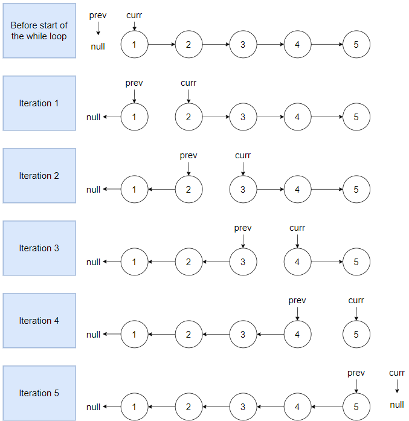

# 206. Reverse Linked List

### Approach 1 - Using extra space

`Explanation`

In this problem we are asked to reverse a linked list. Now the linked list is a singly linked list and in a singly linked list we have only a pointer to the next node. We do not have access to the previous node.

Since we do not have access to the previous node, we will put all the node references of the linked list in an ArrayList. Now, we will iterate on the ArrayList in the reverse direction and change the next pointer of each node.

`Algorithm`

1. Create an ArrayList, which will be used to store node references of linked list.
2. Create a variable tmp which is used to iterate on the linked list.
3. Iterate on the linked list and put the linked list node in ArrayList.
4. Iterate on the ArrayList in the reverse direction and change the next pointer.
5. At the end assign the 0<sup>th</sup> index next pointer to null.

`Code`

```java
class Solution {
    public ListNode reverseList(ListNode head) {
        if(head == null) return null;
        List<ListNode> list = new ArrayList<>();
        ListNode tmp = head;
        // Iterating on the linked list.
        while(tmp != null) {
            list.add(tmp);
            tmp = tmp.next;
        }
        int listSize = list.size();
        // Iterating on the list in reverse direction
        for(int i = listSize-1; i > 0; i--) {
            list.get(i).next = list.get(i-1);
        }
        list.get(0).next =  null;
        return list.get(listSize-1);
    }
}

```

> `Time Complexity` - O(N), where NN is the size of the linked list.

> `Space Complexity` - O(N), we have used a list to store the linked list node.

### Approach 2 - Iterative Method (Optimal).

`Explanation`

The previous approach works, but it uses extra space. The interviewer will ask to optimize the space.

We know that we cannot access the previous node from the current node in a singly linked list. So we can keep a pointer to keep track of the previous node of the current node. Now, we want the next pointer of the current node to point at the previous node. So we can iterate on the linked list and keep track of the previous node and the current node, and for each node, we can set its next pointer to point at the previous node.

But if we directly set the current node next to the previous node, we will lose the reference of the next node of the current node. To overcome this issue, we can store the reference of the next node of the current node before setting the next pointer.

`Algorithm`

1. Create two variables currentNode and previousNode. Initially currentNode points to the head and previousNode points to null.
2. Iterate on the linked list till the currentNode reaches to null and inside the loop
   - Store the reference of the next node of the current node in a variable.
   - Changes the next pointer of the currentNode to point to the previousNode
   - Assign previousNode to currentNode
   - Assign currentNode to the nextNode.
3. At the end of the loop the previousNode points to the head of the reversed linked list.

`Dry Run`



`Code`

```java
public ListNode reverseList(ListNode head) {
    if(head == null) return null;
    ListNode currentNode = head, previousNode = null;
    while(currentNode != null) {
        ListNode nextNode = currentNode.next;
        currentNode.next = previousNode;  // Setting next pointer of currentNode to previousNode
        previousNode = currentNode;
        currentNode = nextNode;
    }
    return previousNode;
}

```

> `Time Complexity` - O(N), where N is the size of the linked list.

> `Space Complexity` - O(1), we have just rearranged the pointer.

### Approach 3 - Using recursion

`Explanation`

For each node in the linked list we are first storing the next node of the current node and then setting the next of the current node to the previous node. After reversing the current link we move on to the next node and repeat the same process.

As we can see above, after reversing a single link, the problem reduces to the similar problem of reversing the remaining linked list.

Now in the cases where we can solve a particular problem by calling a copy of itself and solving smaller sub-problems of the original problem, we can use recursion.

The approach will be similar to the iterative approach.

Base case: When we reach to the end of the linked list then we return the previous node as it is pointing to the head of the reversed linked list.

`Algorithm`

1. We have an original problem of reversing a linked list. We create a function where we pass currentNode and previousNode.
2. Now, the logic of reversing the current node is to first store the next of the current node and then assign the next of the current node to the previous node.
3. We call the recursive function again, with a smaller linked list to reverse.

`Code`

```java
public ListNode reverseLinkedListUsingRecursion(ListNode currentNode, ListNode previousNode) {
    if(currentNode == null) { // Base Case
        return previousNode;
    }
    ListNode nextNode = currentNode.next;
    currentNode.next = previousNode;
    // Calling the same problem but for smaller input.
    return reverseLinkedListUsingRecursion(nextNode, currentNode);
}
public ListNode reverseList(ListNode head) {
    return reverseLinkedListUsingRecursion(head, null);
}

```

> `Time Complexity` - O(N), where N is the size of the linked list.

> `Space Complexity` - O(N), function call stack as we are using recursion.
